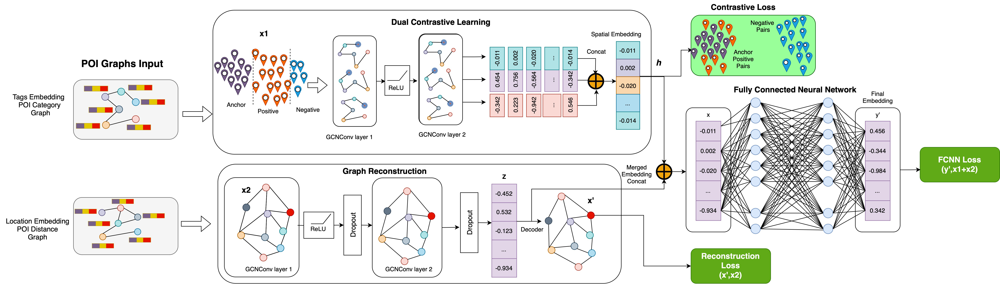

In order to generate the context aware POI embeddings then please run 
```sh
python poi_embedding.py
```

In order to run the Downstream tasks
```sh
python Downstream_tasks/functional_distribution_learning.py
```
```sh
python Downstream_tasks/population_density.py
```

The system architecture of multi-task and context-aware POI embeddings:


Data and groudtruth files are not uploaded in the repository which can be requested via email sheikh.zoha90@gmail.com.
